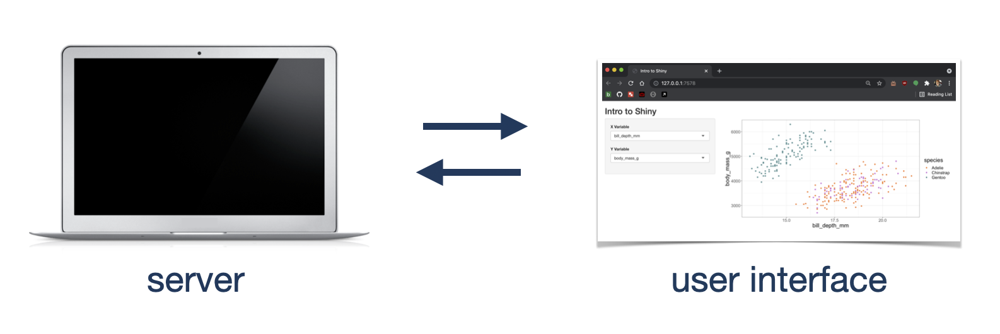
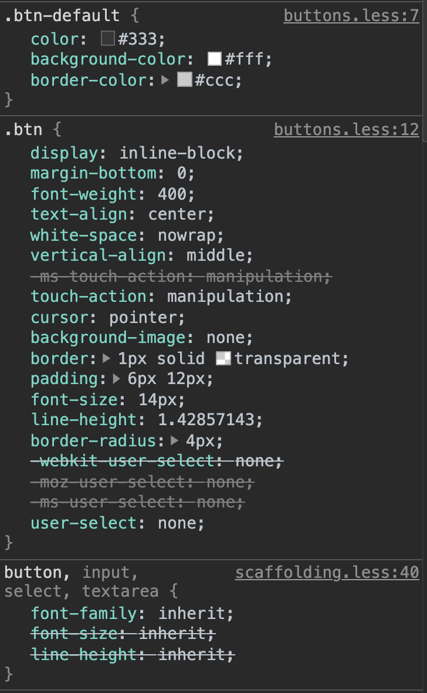
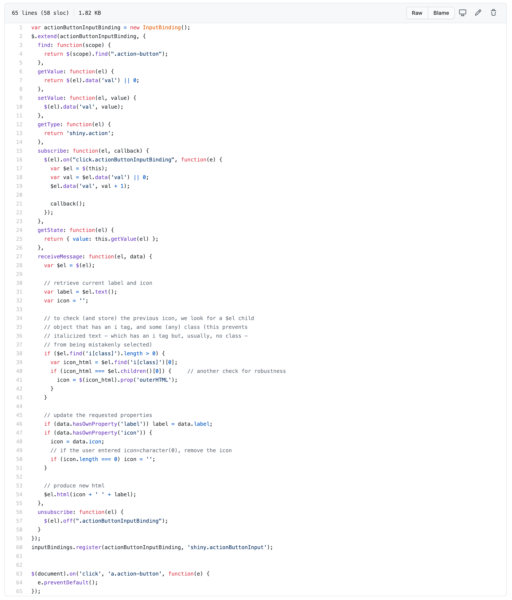
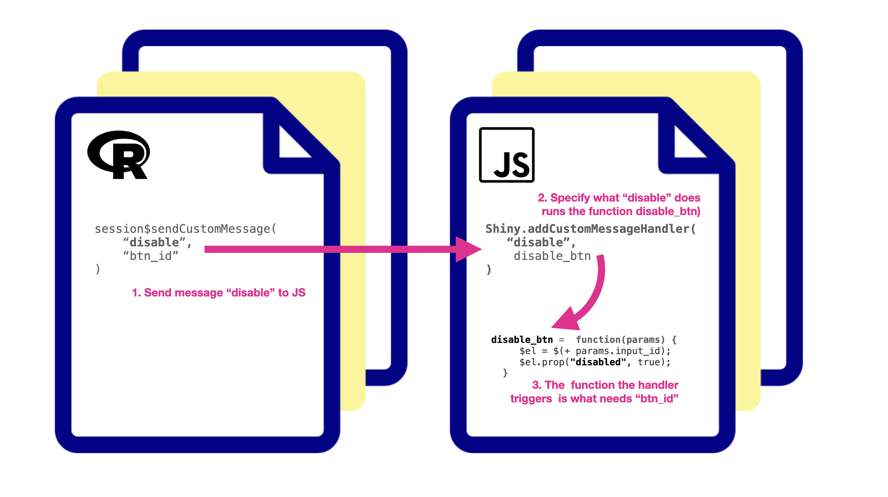
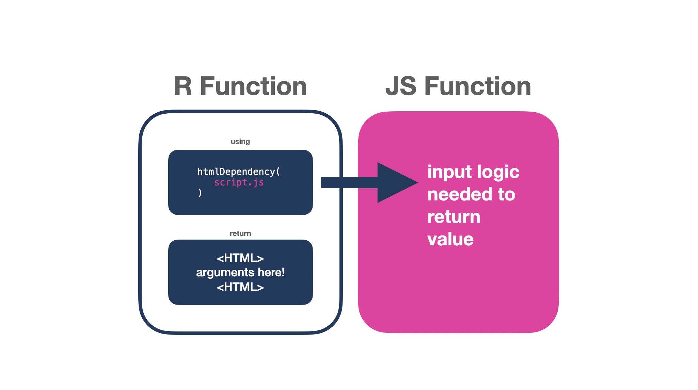

class: right middle hide-count
background-color: white
background-image: url(https://images.unsplash.com/photo-1557672172-298e090bd0f1?ixlib=rb-1.2.1&ixid=MXwxMjA3fDB8MHxzZWFyY2h8M3x8cGF0dGVybnxlbnwwfHwwfA%3D%3D&auto=format&fit=crop&w=800&q=60)
background-position: left

## A Little JS Goes a Long Way
<div class="under">
By Maya Gans <br>
<span style="font-size:0.5em;">@Mayacelium</span>
</div>


```{r setup, include=FALSE}
options(htmltools.dir.version = FALSE)
knitr::opts_chunk$set(highlight = TRUE)
```

```{r xaringan-themer, include=FALSE}
library(xaringanthemer)
mono_light(
  white_color = "#fff",
  header_font_google = google_font("Poppins", "600"),
  text_font_google = google_font("Karla", "300", "300i"),
  code_font_google = google_font("Fira Code"),
  text_font_size = "24px",
  code_font_size = "0.7em"
)
```

---

.header[
#R + JS = <3
]

.content[
### Shiny Under the Hood
### R to JS
### JS to R
]

---

background-color: var(--header-color)

<h1 style="position:fixed;top:30%;left:25%;">But first:<br>A Shiny Explanation</h1><br>

<span style="color:white;
    position: fixed;
    left: 25%;
    top: 60%;">DEMO APP</span>

---
.header[
<h3 style="color:white;">Behind every shiny app is a computer running R</h3>
]

.contentimg[
### Shiny apps Have TWO components


]

---

.header-left[
# UI
]

.content-right[
```{r, eval=FALSE}
ui <- fluidPage(
    titlePanel("Intro to Shiny"),

    sidebarLayout(
        sidebarPanel(
            selectInput("xvar", 
                        "X Variable", 
                        choices = numericPenguins),
            selectInput("yvar", 
                        "Y Variable", 
                        choices = numericPenguins)
        ),
        mainPanel(
           plotOutput("penguinPlot")
        )
    )
)
```
]

---

.header-left[
# Server
]

.content-right[
```{r, eval=FALSE}
server <- function(input, output) {
    # call the output of our plot input
    output$penguinPlot <- renderPlot({
    # use the input values 
    # xvar and yvar to create our plot
    # note:
    # pass in x and y as strings!
    ggplot(penguins, 
           aes_string(x = input$xvar, 
                      y = input$yvar, 
                      color = 'species')) +
            geom_point() 
}

```
]

---

background-color: var(--header-color)

<h1 style="position:fixed;top:30%;left:22%;">Put it together:</h1><br>

<h3 style="position:fixed;top:42%;left:22%;color:white;">shinyApp(ui = ui, server = server)</h1><br>

---

.header[
# Shiny is a wrapper
]

<script>
function change() {
    var text  = document.getElementById('div_demo');
    if (text.innerHTML =="Button Clicked") text.innerHTML = "";
    else text.innerHTML = "Button Clicked";
}
</script>

.content[

.pull-left[
```{r, eval=FALSE}
library(shiny)

ui <- fluidPage(
    actionButton("btn_demo", "CLICK") #<<
)

server <- function(input, output) {
    observeEvent(input$btn_demo, {
        print("Button Clicked")
    })
}

shinyApp(ui, server)
```
]

.pull-right[
<button id="btn_demo" type="button" class="btn btn-default action-button shiny-bound-input" onclick='change()'>CLICK</button>

<div id="div_demo"></div>
]
]

---

.header[
# Shiny is a wrapper
]

.content[
.cardbox[
<div class="flip-card">
  <div class="flip-card-inner">
    <div class="flip-card-front">
    <h2>HTML</h2>
    </div>
    <div class="flip-card-back">
      <h3>Hypertext Markup Language</h3> 
      &lt;button&gt;CLICK&lt;/button&gt;
    </div>
  </div>
</div>

<div class="flip-card">
  <div class="flip-card-inner">
    <div class="flip-card-front">
    <h2>CSS</h2>
    </div>
    <div class="flip-card-back">
      <h3>Cascading Style Sheets</h3> 
      <div style="text-align:left !important;padding-left:2px;">
      &nbsp;button { <br>
      &nbsp;&nbsp;&nbsp;&nbsp;background-color: pink; <br>
      &nbsp;}
      </div>
    </div>
  </div>
</div>

<div class="flip-card">
  <div class="flip-card-inner">
    <div class="flip-card-front">
    <h2>JavaScript</h2>
    </div>
    <div class="flip-card-back">
      <h3>The Language of the Internet!</h3> 
       <div style="text-align:left !important;padding-left:2px;font-size:0.6em;padding-left:20px;">
      function change() { <br>
      document.getElementById('div_demo') <br>
          .innerHTML = "Button Clicked"; <br>
      }
      </div>
    </div>
  </div>
</div>
]
]

---

.header[
# HTML
]


.content[
```{r, eval=FALSE}
shiny::actionButton

function (inputId, label, icon = NULL, width = NULL, ...) 
{
    value <- restoreInput(id = inputId, default = NULL)
    tags$button(id = inputId, style = if (!is.null(width)) #<<
        paste0("width: ", validateCssUnit(width), ";"), type = "button", 
        class = "btn btn-default action-button", `data-val` = value, 
        list(validateIcon(icon), label), ...)
}


shiny::tags$button #<<

<button></button>
```
]

---

.header[
# CSS
]

.content[

.another-pull-left[
```{r, eval=FALSE}
function (inputId, label, icon = NULL, width = NULL, ...) 
{
    value <- restoreInput(id = inputId, default = NULL)
    tags$button(id = inputId, style = if (!is.null(width)) 
        paste0("width: ", validateCssUnit(width), ";"), type = "button", 
        class = "btn btn-default action-button", `data-val` = value, 
        list(validateIcon(icon), label), ...)
}
```
]

.another-pull-right[

]

]


---

.header[
# JavaScript
]

.content[
<div class="scroll-up">
<div class="inner">

]


---

.header[
# Let's Toggle a Button's State
]

.content[
.pull-left[

<code class="r hljs remark-code">
&lt;button class="btn" <span style="color:#8FC1E2;;">disabled</span>&gt;<br>CLICK ME<br>&lt;/button&gt;
</code>

<code class="r hljs remark-code">
&lt;button class="btn"&gt;<br>CLICK ME<br>&lt;/button&gt;
</code>
]

.pull-right[
<div class="centered-content">
<br><br>
<button class="btn" disabled>CLICK ME</button>
<br><br><br>
<button class="btn">CLICK ME</button>
</div>
]
]

---

.header[
# R to JS
]

.content[
When I click ID I want to X using JavaScript.
]


---

.header[
# R to JS
]

.content[
When I click <span style="color:#FF71C3;">demo_btn</span> I want to <span style="color:#FF71C3;">disable it</span> using JavaScript.
]


---

.header[
# Sending a Message to JS
]

.contentimg[

</img>

]

---

.header[
# R: sendCustomMessage
]

.content[
```{r, eval=FALSE}
disable_element <- function(.id) {
  # so we don't have to pass session as an arg
  session <- shiny::getDefaultReactiveDomain()
  # send a message and content
  session$sendCustomMessage(
    "disable",
    list(input_id = .id)
  )
}
```
]


---

.header[
# JS: addCustomMessageHandler
]

.content[
```{r, eval=FALSE}
Shiny.addCustomMessageHandler("disable", 
  function(params) {
     $el = $("#" + params.input_id);
     $el.prop("disabled", true);
  }
  
);
```
]

---

.header[
# Now toggle!
]

.content[
```{r}
toggle_element <- function(id, condition) {
  
  # being extra because I want the user
  # to be able to supply the id as input$ID
  id <- deparse(substitute(id))
  id <- gsub(".*\\$", "", id)
  
  # now we have id without input$
  # to use in JS
  if (!condition) {
    disable_element(.id = id)
  } else if (condition) {
    enable_element(.id = id)
  }
}
```
]

---
.header[
# Putting it Together
]

.content[
.pull-left[
```{r, eval=FALSE}
ui <- fluidPage(
    includeScript("www/source.js"),
    actionButton("toggle_state", "CLICK ME"),
    actionButton("to_be_toggled", "CLICKED?")
)

server <- function(input, output) {
    observeEvent(input$toggle_state, {
        toggle_element(input$to_be_toggled,
         input$toggle_state %% 2 == 0
        )
    })
}

shinyApp(ui, server)
```
]
]

<script>
function disable() {
    var disabled = document.getElementById('btn_demo2_result').disabled
    if (disabled) document.getElementById('btn_demo2_result').disabled = false;
    else document.getElementById('btn_demo2_result').disabled = true;
}
</script>

.pull-right[
<br><br>
<button id="btn_demo2_click" type="button" class="btn" onclick='disable()'>CLICK ME</button>
<br><br>
<button id="btn_demo2_result" type="button" class="btn">CLICKED?</button>
]


---

.header[
# JS to R
]

.content[
When I X on Y I want to return a VALUE to Shiny
]

---

.header[
# JS to R
]

.content[
When I <span style="color:#FF71C3;">click</span> on <span style="color:#FF71C3;">a circle</span> I want to return the <span style="color:#FF71C3;">circle color</span> to Shiny
]

---

.header[
# JS to R
]

.content[
When I <span style="color:#FF71C3;">click</span> on <span style="color:#FF71C3;">a circle</span> I want to return the <span style="color:#FF71C3;">circle color</span> to Shiny
]

---

.header[
# Custom Inputs
]

.contentimg[

</img>

]

---

.header[
# Shiny
]

.content[

.pull-left[
```{r, eval=FALSE}
library(shiny)
source("circleInput.R")

ui <- fluidPage(
  circleInput("circles"),
  verbatimTextOutput("debug")
)

server <- function(input, output) {
  output$debug <- renderText(input$circles)
}

shinyApp(ui = ui, server = server)
```
]

.pull-right[

<script>
function changeColor(color) {
  document.getElementById('circle_color').innerHTML = color
}
</script>

<br><br>

<div style="text-align:center;">
<span style="color:gray;">click a circle</span><br>
<svg class='circ' height='100' width='100' xmlns='http://www.w3.org/2000/svg'>
        <circle circle-type ='circ_red' cx='50' cy='50' r='40' stroke='black' stroke-width='3' fill='red' onclick="changeColor('red')" />
      </svg>
      <svg id ='circ_blue' class='circ' height='100' width='100' xmlns='http://www.w3.org/2000/svg'>
        <circle circle-type ='circ_blue' cx='50' cy='50' r='40' stroke='black' stroke-width='3' fill='blue' onclick="changeColor('blue')"/>
      </svg>
      <svg id ='circ_yellow'class='circ' height='100' width='100' xmlns='http://www.w3.org/2000/svg'>
        <circle circle-type ='circ_yellow' cx='50' cy='50' r='40' stroke='black' stroke-width='3' fill='yellow' onclick="changeColor('yellow')"/>
      </svg>
      </div>
      
<div id="circle_color" style="font-size:2em;text-align:center;"></div>
]
]

---

class: center

.header[
<div style="text-align:left;">
<h1>setInputValue</h1>
</div>
]

.content[

.htmldep[
.pull-left[
```{r, eval=FALSE}
circleInput <- function(inputId) {
  htmltools::tagList(
    htmltools::htmlDependency(
      name    = "circleInput"
      , version = "0.0.1"
      , src = "inst"
      , script  = "circles.js" #<<
    ),
    htmltools::tags$div(
      class = "circleInput",
      id = inputId,
      `data-input-id` = inputId,
      htmltools::HTML(
        "<svg class='circ' height='100' width='100' xmlns='http://www.w3.org/2000/svg'>
        <circle circle-type ='circ_red' cx='50' cy='50' r='40' stroke='black' stroke-width='3' fill='red'/>
      </svg>
      <svg id ='circ_blue' class='circ' height='100' width='100' xmlns='http://www.w3.org/2000/svg'>
        <circle circle-type ='circ_blue' cx='50' cy='50' r='40' stroke='black' stroke-width='3' fill='blue' />
      </svg>
      <svg id ='circ_yellow'class='circ' height='100' width='100' xmlns='http://www.w3.org/2000/svg'>
        <circle circle-type ='circ_yellow' cx='50' cy='50' r='40' stroke='black' stroke-width='3' fill='yellow'/>
      </svg>"
      )
    )
  )
}
```
]

.pull-right[
.blue[
```{r, eval=FALSE}
$( document ).ready(function() {
  $('#circles').on('click', '.circ', (ev) => {
  var circle_color = event.target.getAttribute("circle-type")
  Shiny.setInputValue('circles', circle_color)
})
});
```
]
]
]

]

---


class: center

.header[
<div style="text-align:left;">
<h1>Shiny.InputBinding</h1>
</div>
]

.content[

.htmldep[
.pull-left[
```{r, eval=FALSE}
circleInput <- function(inputId) {
  htmltools::tagList(
    htmltools::htmlDependency(
      name    = "circleInput"
      , version = "0.0.1"
      , src = "inst"
      , script  = "circleInput.js" #<<
    ),
    htmltools::tags$div(
      class = "circleInput",
      id = inputId,
      `data-input-id` = inputId,
      htmltools::HTML(
        "<svg class='circ' height='100' width='100' xmlns='http://www.w3.org/2000/svg'>
        <circle circle-type ='circ_red' cx='50' cy='50' r='40' stroke='black' stroke-width='3' fill='red'/>
      </svg>
      <svg id ='circ_blue' class='circ' height='100' width='100' xmlns='http://www.w3.org/2000/svg'>
        <circle circle-type ='circ_blue' cx='50' cy='50' r='40' stroke='black' stroke-width='3' fill='blue' />
      </svg>
      <svg id ='circ_yellow'class='circ' height='100' width='100' xmlns='http://www.w3.org/2000/svg'>
        <circle circle-type ='circ_yellow' cx='50' cy='50' r='40' stroke='black' stroke-width='3' fill='yellow'/>
      </svg>"
      )
    )
  )
}
```
]

.pull-right[
.blue[
```{r, eval=FALSE}
var shinyCircleBinding = new Shiny.InputBinding();
$.extend(shinyCircleBinding, {
  
  find: function find(scope) {
    return $(scope).find(".circleInput")
  },
  
  getValue: function getValue(el) {
    var value = $(el).find('.selected').attr("circle-type")
    return value
  },

  subscribe: function(el, callback) {
    $(el).on("click.shinyCircleBinding", function(evt) {
      $(el).find(".selected").removeClass("selected");
      $(evt.target).addClass('selected');
      callback();
    })
  },
  unsubscribe: function(el) {
    $(el).off(".shinyCircleBinding");
  }
});


Shiny.inputBindings.register(shinyCircleBinding, 'shinylearnrdemo.circleInput');
```
]]]]

---

.header[
# Must Reads
]

.content2[
## Books
- [JavaScript for R by John Coene](https://javascript-for-r.com/)
- [Outstanding User Interfaces with Shiny by David Granjon](https://unleash-shiny.rinterface.com/)


## Code
- [shinyWidgets](https://github.com/dreamRs/shinyWidgets)
- [js4shiny](https://github.com/gadenbuie/js4shiny)
- [Jonathan Trattner's JS + Shiny](https://www.jdtrat.com/talks/shiny-js/slides#1)
]